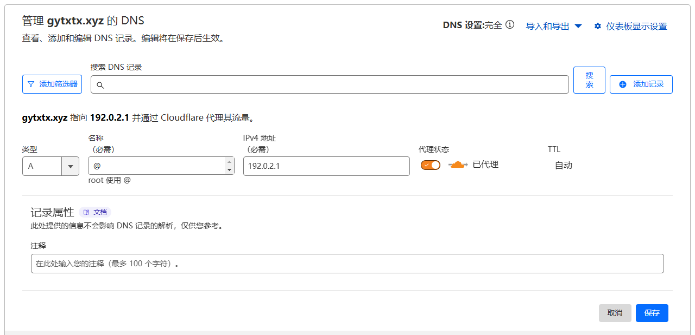
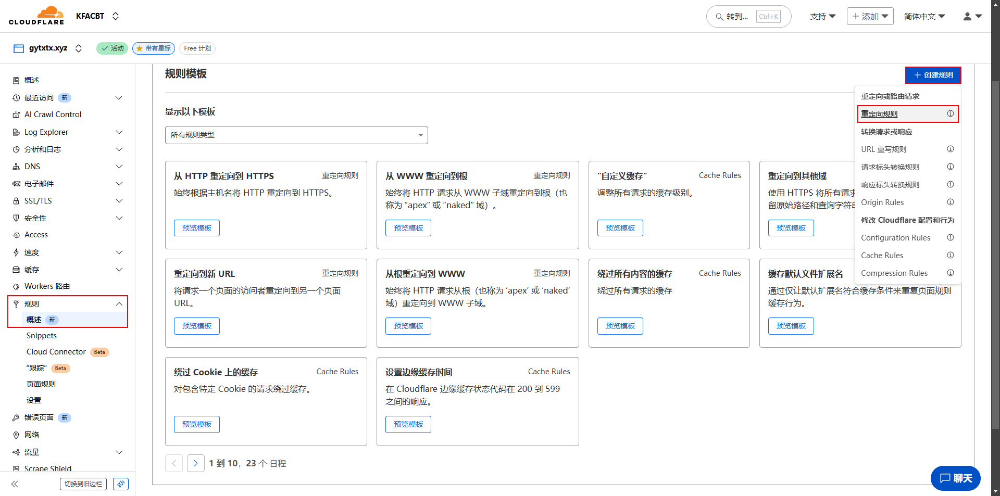
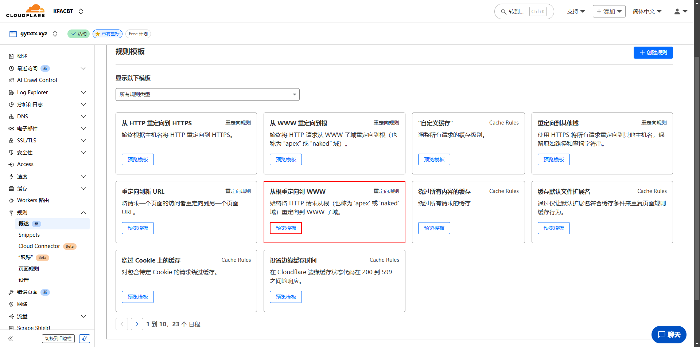
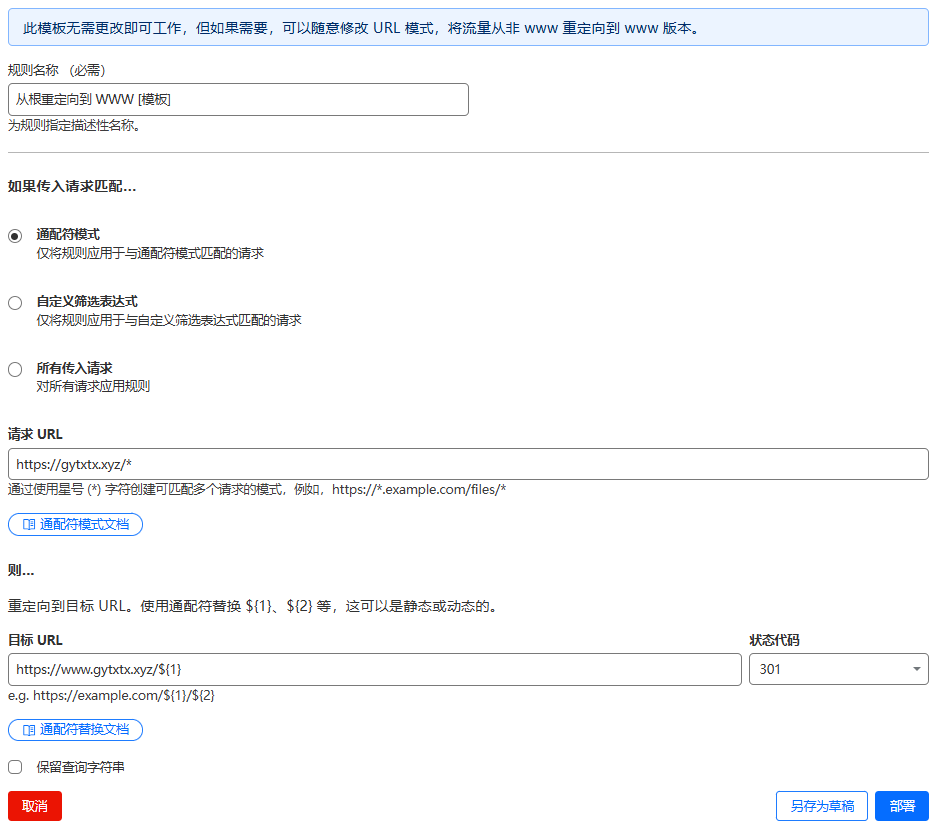

---
date:
  created: 2025-10-01

# draft: true

readtime: 5

authors:
  - gytxtx

categories:
  - 建站

slug: Cloudflare-Redirect

links:
  - Cloudflare 仪表板: https://dash.cloudflare.com/login
  - 文章来源: https://www.eilo.uk/posts/6abf4a82/

comments: true
---

# 使用 Cloudflare DNS 轻松实现域名重定向

喜迎国庆假期，可算有时间了，那就写一篇博客吧 ~~（水）~~

我之前也有重定向域名的需求，但不想消耗服务器资源 ~~（说到底还是没有钱）~~，当时的我采取了用静态网页托管 + JavaScript 重定向的方式。这篇文章将会记录使用 Cloudflare DNS 实现域名重定向的方法。
<!-- more -->
---

## 准备工作

* Cloudflare 账号
* 要重定向的域名（需提前绑定在 Cloudflare）

这里用我的域名 `gytxtx.xyz` 作为示例，演示从根域名 `gytxtx.xyz` 重定向为 `www.gytxtx.xyz` 的方法。

## 1. 添加 DNS 记录
进入 Cloudflare -> 点击需要重定向的主域名 -> DNS

之后，为你的根域名 `@` 添加一条 A 记录，指向任意 dummy IP（比如 `192.0.2.1`），并确保开启 Proxy（代理）：

## 2. 创建重定向规则
进入 Cloudflare -> 点击需要重定向的主域名 -> 规则 -> 创建规则 -> 重定向规则
  
选择模板 **从根重定向到 WWW**：

当然，也可以这样：

此时，模板应该是这个样子：

!!! note "提示"
    此处的 `gytxtx.xyz` 可替换为您自己的域名。

## 3. 保存并部署
点击 **部署**，稍等几分钟规则即可生效。

此时，访问 `https://gytxtx.xyz/example?foo=bar` 将会重定向到 `https://www.gytxtx.xyz/example?foo=bar`。

!!! note "小提示"
    可自行探索 Cloudflare 规则模板，实现其他操作。
