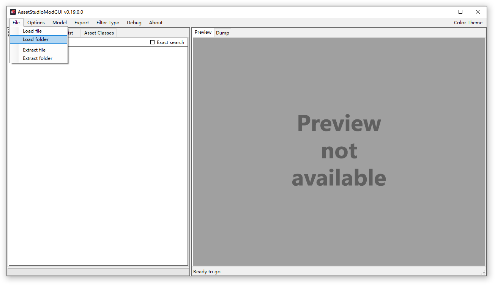
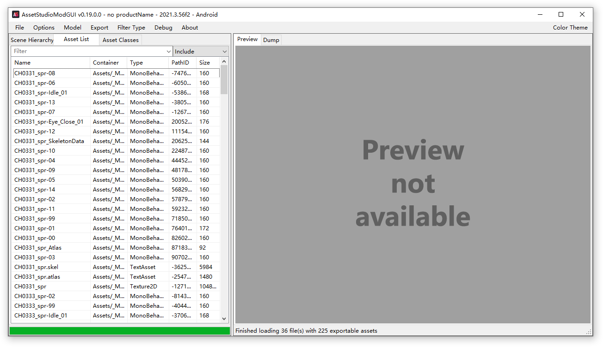
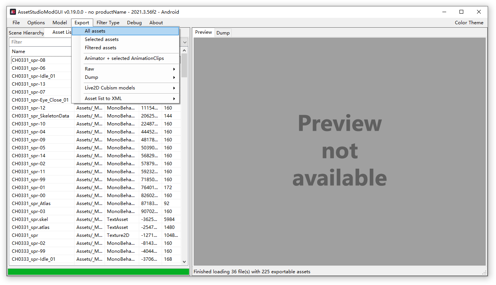
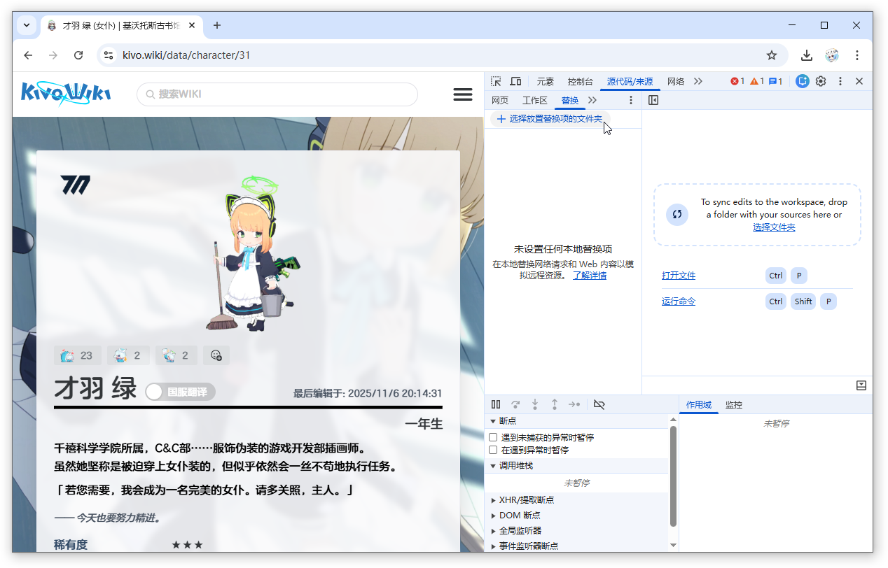
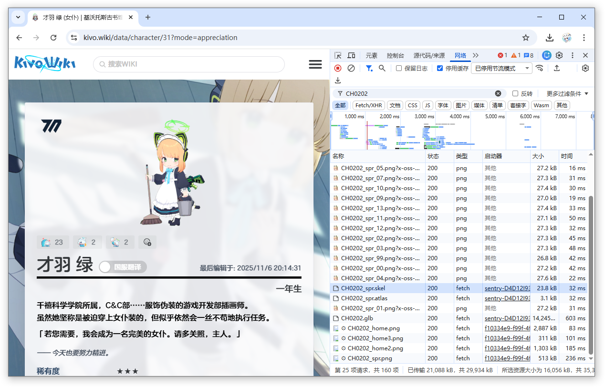
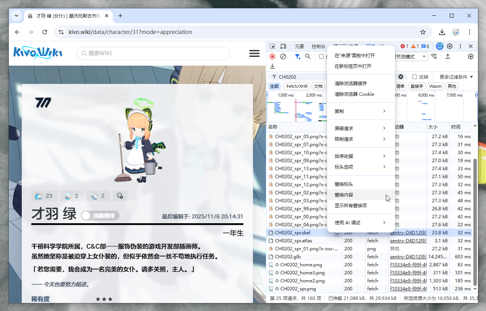
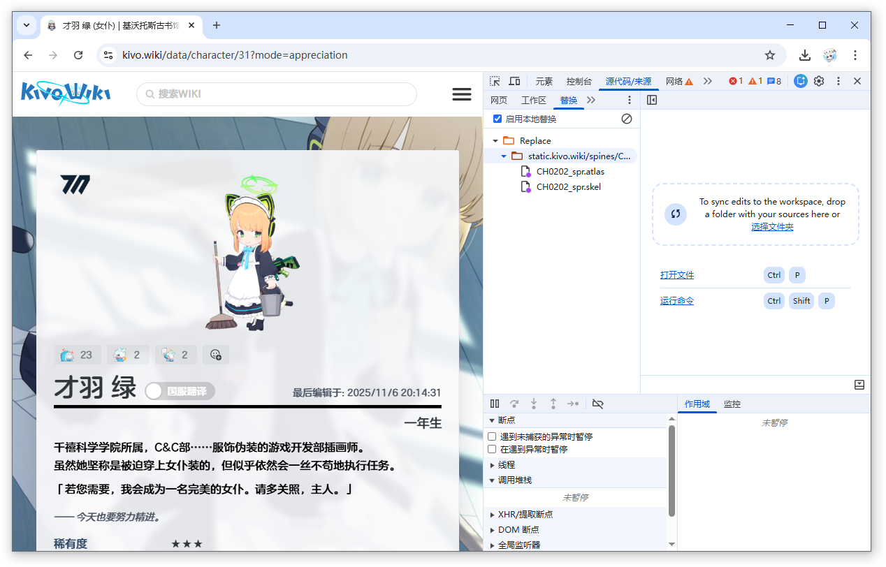

---
date:
  created: 2026-01-18

# draft: true

readtime: 6

authors:
  - gytxtx

categories:
  - 技术

slug: Blue-Srchive-Sprine

comments: true
---

# Blue Archive Spine 立绘提取与自定义导出全流程

## 起因

Yostar 公布了 Blue Archive 5 周年的一些新内容，但官方没有放出新角色的立绘。我想尝试根据游戏资源生成立绘，本篇文章记录了整个过程。

<!-- more -->

## 步骤

### 1. 获取游戏文件

在获取 Blue Archive 日服 Android 端的更新文件后，跳转到 `/storage/emulated/0/Android/data/com.YostarJP.BlueArchive/files/AssetBundles/` 文件夹。

筛选出 `assets-_mx-spinecharacters-` 开头的 .bundle 文件。

这里我筛选出了下列文件：

```txt
❯ ls

    Directory: ...\com.YostarJP.BlueArchive\files\AssetBundles

Mode                 LastWriteTime         Length Name
----                 -------------         ------ ----
-a---           2026/1/18    19:10           4361 assets-_mx-spinecharacters-ch0331_spr-_mxdependency-assets-2026-01-09
                                                  _assets_all_4104145137.bundle
-a---           2026/1/18    19:10           2742 assets-_mx-spinecharacters-ch0331_spr-_mxdependency-materials-2026-01
                                                  -09_assets_all_2644861020.bundle
-a---           2026/1/18    19:10           6203 assets-_mx-spinecharacters-ch0331_spr-_mxdependency-textassets-2026-0
                                                  1-09_assets_all_462340494.bundle
-a---           2026/1/18    19:10         543109 assets-_mx-spinecharacters-ch0331_spr-_mxdependency-textures-2026-01-
                                                  09_assets_all_220710728.bundle
-a---           2026/1/18    19:10           4057 assets-_mx-spinecharacters-ch0333_spr-_mxdependency-assets-2026-01-09
                                                  _assets_all_4037417064.bundle
-a---           2026/1/18    19:10           2711 assets-_mx-spinecharacters-ch0333_spr-_mxdependency-materials-2026-01
                                                  -09_assets_all_3727421082.bundle
-a---           2026/1/18    19:10           7004 assets-_mx-spinecharacters-ch0333_spr-_mxdependency-textassets-2026-0
                                                  1-09_assets_all_2111289520.bundle
-a---           2026/1/18    19:10         332046 assets-_mx-spinecharacters-ch0333_spr-_mxdependency-textures-2026-01-
                                                  09_assets_all_2290143979.bundle
-a---           2026/1/18    19:10           4632 assets-_mx-spinecharacters-ch0334_spr-_mxdependency-assets-2026-01-09
                                                  _assets_all_3431013955.bundle
-a---           2026/1/18    19:10           2741 assets-_mx-spinecharacters-ch0334_spr-_mxdependency-materials-2026-01
                                                  -09_assets_all_3563143968.bundle
-a---           2026/1/18    19:10           7671 assets-_mx-spinecharacters-ch0334_spr-_mxdependency-textassets-2026-0
                                                  1-09_assets_all_634072618.bundle
-a---           2026/1/18    19:10         557739 assets-_mx-spinecharacters-ch0334_spr-_mxdependency-textures-2026-01-
                                                  09_assets_all_2719927046.bundle
-a---           2026/1/18    19:10           4235 assets-_mx-spinecharacters-ch0336_spr-_mxdependency-assets-2026-01-09
                                                  _assets_all_2770075460.bundle
-a---           2026/1/18    19:10           2742 assets-_mx-spinecharacters-ch0336_spr-_mxdependency-materials-2026-01
                                                  -09_assets_all_547714503.bundle
-a---           2026/1/18    19:10           5221 assets-_mx-spinecharacters-ch0336_spr-_mxdependency-textassets-2026-0
                                                  1-09_assets_all_4293244063.bundle
-a---           2026/1/18    19:10         464201 assets-_mx-spinecharacters-ch0336_spr-_mxdependency-textures-2026-01-
                                                  09_assets_all_168606888.bundle
-a---           2026/1/18    19:10           4523 assets-_mx-spinecharacters-ch0337_spr-_mxdependency-assets-2026-01-09
                                                  _assets_all_3996380481.bundle
-a---           2026/1/18    19:10           2741 assets-_mx-spinecharacters-ch0337_spr-_mxdependency-materials-2026-01
                                                  -09_assets_all_3474903601.bundle
-a---           2026/1/18    19:10           6831 assets-_mx-spinecharacters-ch0337_spr-_mxdependency-textassets-2026-0
                                                  1-09_assets_all_2623730915.bundle
-a---           2026/1/18    19:10         613184 assets-_mx-spinecharacters-ch0337_spr-_mxdependency-textures-2026-01-
                                                  09_assets_all_45363624.bundle
-a---           2026/1/18    19:10           4936 assets-_mx-spinecharacters-np0267_spr-_mxdependency-assets-2026-01-09
                                                  _assets_all_838761384.bundle
-a---           2026/1/18    19:10           2742 assets-_mx-spinecharacters-np0267_spr-_mxdependency-materials-2026-01
                                                  -09_assets_all_665777451.bundle
-a---           2026/1/18    19:10           6763 assets-_mx-spinecharacters-np0267_spr-_mxdependency-textassets-2026-0
                                                  1-09_assets_all_3153327340.bundle
-a---           2026/1/18    19:10         364820 assets-_mx-spinecharacters-np0267_spr-_mxdependency-textures-2026-01-
                                                  09_assets_all_2424373075.bundle
-a---           2026/1/18    19:10           4576 assets-_mx-spinecharacters-np0268_spr-_mxdependency-assets-2026-01-09
                                                  _assets_all_56689503.bundle
-a---           2026/1/18    19:10           2712 assets-_mx-spinecharacters-np0268_spr-_mxdependency-materials-2026-01
                                                  -09_assets_all_1084959363.bundle
-a---           2026/1/18    19:10           6756 assets-_mx-spinecharacters-np0268_spr-_mxdependency-textassets-2026-0
                                                  1-09_assets_all_600220194.bundle
-a---           2026/1/18    19:10         363518 assets-_mx-spinecharacters-np0268_spr-_mxdependency-textures-2026-01-
                                                  09_assets_all_874481245.bundle
-a---           2026/1/18    19:10           4575 assets-_mx-spinecharacters-np0269_spr-_mxdependency-assets-2026-01-09
                                                  _assets_all_2538252456.bundle
-a---           2026/1/18    19:10           2742 assets-_mx-spinecharacters-np0269_spr-_mxdependency-materials-2026-01
                                                  -09_assets_all_3587430121.bundle
-a---           2026/1/18    19:10           6284 assets-_mx-spinecharacters-np0269_spr-_mxdependency-textassets-2026-0
                                                  1-09_assets_all_1288322186.bundle
-a---           2026/1/18    19:10         434169 assets-_mx-spinecharacters-np0269_spr-_mxdependency-textures-2026-01-
                                                  09_assets_all_3828771965.bundle
-a---           2026/1/18    19:10           4131 assets-_mx-spinecharacters-np0278_spr-_mxdependency-assets-2026-01-09
                                                  _assets_all_379667446.bundle
-a---           2026/1/18    19:10           2742 assets-_mx-spinecharacters-np0278_spr-_mxdependency-materials-2026-01
                                                  -09_assets_all_139422215.bundle
-a---           2026/1/18    19:10           5262 assets-_mx-spinecharacters-np0278_spr-_mxdependency-textassets-2026-0
                                                  1-09_assets_all_1489539279.bundle
-a---           2026/1/18    19:10         461002 assets-_mx-spinecharacters-np0278_spr-_mxdependency-textures-2026-01-
                                                  09_assets_all_3394693095.bundle

```

将筛选出来的文件放到一个新文件夹中，下个步骤将会使用这些文件。

筛选完文件之后，是时候从这些 .bundle 文件中提取资源了。

### 2. 提取游戏资源

因为 Blue Archive 使用 Unity 引擎，因此需要一个提取 Unity 引擎资产文件的工具。

我这里使用 [AssetStudio](https://github.com/aelurum/AssetStudio)。

解压缩最新版本的文件后，打开 `AssetStudioModGUI.exe`。

点击 File > Load folder 选项：



在弹出的文件选择窗口中，选择步骤 1 的文件夹，并点击“选择文件夹”按钮。

此时，软件应该会自动解析这些 .bundle 文件，并将提取的资产显示在 Asset list 页面中：



提取资产之后，接下来保存提取的资产文件 。

选择 Export > All assets 选项，在弹出的文件选择窗口中选择一个文件夹，以保存提取的资产文件。



等待导出完成后，第二步就完成了。

### 3. 导入角色立绘文件

```txt
❯ ls

    Directory: ...\Exported

Mode                 LastWriteTime         Length Name
----                 -------------         ------ ----
d----           2026/1/18    23:24                MonoBehaviour
d----           2026/1/18    23:24                TextAsset
d----           2026/1/18    23:24                Texture2D
```

在 `TextAsset`  和 `Texture2D` 文件夹中，可以看到提取出的角色立绘文件。

```txt
❯ ls

    Directory: ...\Exported\TextAsset

Mode                 LastWriteTime         Length Name
----                 -------------         ------ ----
-a---           2026/1/18    23:24           1454 CH0331_spr.atlas
-a---           2026/1/18    23:24           5958 CH0331_spr.skel
-a---           2026/1/18    23:24           1154 CH0333_spr.atlas
-a---           2026/1/18    23:24           7183 CH0333_spr.skel
-a---           2026/1/18    23:24           1712 CH0334_spr.atlas
-a---           2026/1/18    23:24           7527 CH0334_spr.skel
-a---           2026/1/18    23:24            983 CH0336_spr.atlas
-a---           2026/1/18    23:24           5035 CH0336_spr.skel
-a---           2026/1/18    23:24           1480 CH0337_spr.atlas
-a---           2026/1/18    23:24           6843 CH0337_spr.skel
-a---           2026/1/18    23:24           2008 NP0267_spr.atlas
-a---           2026/1/18    23:24           6758 NP0267_spr.skel
-a---           2026/1/18    23:24           1602 NP0268_spr.atlas
-a---           2026/1/18    23:24           6686 NP0268_spr.skel
-a---           2026/1/18    23:24           1582 NP0269_spr.atlas
-a---           2026/1/18    23:24           5542 NP0269_spr.skel
-a---           2026/1/18    23:24            926 NP0278_spr.atlas
-a---           2026/1/18    23:24           5024 NP0278_spr.skel
```

```txt
❯ ls

    Directory: ...\Exported\Texture2D

Mode                 LastWriteTime         Length Name
----                 -------------         ------ ----
-a---           2026/1/18    23:24         771136 CH0331_spr.png
-a---           2026/1/18    23:24         702766 CH0333_spr.png
-a---           2026/1/18    23:24         935904 CH0334_spr.png
-a---           2026/1/18    23:24         740377 CH0336_spr.png
-a---           2026/1/18    23:24         955903 CH0337_spr.png
-a---           2026/1/18    23:24         818096 NP0267_spr.png
-a---           2026/1/18    23:24         816195 NP0268_spr.png
-a---           2026/1/18    23:24         656341 NP0269_spr.png
-a---           2026/1/18    23:24         688814 NP0278_spr.png
```

观察文件扩展名不难发现，`.skel` 文件是 Spine 的骨骼文件；`.atlas` 则是 Spine 图集数据文件。

因此，我们需要一个可以解析并导出最终立绘的 Spine Viewer。

---

一开始，我选择了 Spine 官方的编辑软件，但我没有正版 Spine，而免费试用版无法保存和导出任何数据，无奈只能作罢。

之后，我在 GitHub 上搜索可以导出 Spine 立绘的项目，虽然找到了几款，但其导出功能是根据立绘在软件中的位置与缩放决定的，达不到理想效果。

最后，我突然想起，Blue Archive 的粉丝 Wiki——[基沃托斯古书馆](https://kivo.wiki/) 有预览 Spine 立绘并导出的功能，何不试试呢？

但网站的立绘浏览与导出功能仅限于网站已有的资源，不支持用户自行上传相关文件并导出。

有没有一种方法，可以自行选择本地的 Spine 文件，但又具有基沃托斯古书馆的导出功能？

于是，我开始了尝试。

在询问了 ChatGPT 之后，我了解到可以通过 Chrome 的 DevTools 完成这项操作。

---

首先，按 `F12` 打开 DevTools，跳转到“源代码/来源”页面。

点击“替换”选项卡，单击“选择放置替换项的文件夹”，并在弹出的对话框中允许开发者工具修改文件。



此时，跳转到“网络”页面，按 `Chrl + R` 重新加载页面后，找到 `.skel` 和 `.atlas` 文件。



分别右击这两个文件，选择“替换内容”选项。



此时，在“源代码/来源”页面应该显示要被替换的文件：



将在之前步骤中提取出的 `.skel` 和 `.atlas` 文件放置到你在 DevTools 中替换的文件夹。

然而，正当我想要替换立绘图片时，“替换内容”选项不可用。

查看了一下获取此资源的代码，发现图片是在 Web Worker 里用 `fetch -> blob -> createImageBitmap` 加载的，DevTools 无法覆盖。

如果要覆盖，只能劫持并向 `window.Worker` 注入代码。

由于我在这方面不太熟练，因此使用 ChatGPT 生成了一段 Tampermonkey 脚本代码：

```js
// ==UserScript==
// @name         Spine Worker Image Override
// @namespace    spine-override
// @version      1.1
// @match        https://kivo.wiki/*
// @run-at       document-start
// @grant        none
// ==/UserScript==

(function () {
  'use strict';

  const TARGET_MAP = {
    'NP0268_spr.png': 'https://example.com/override/NP0268_spr.png',
  };

  const OriginalWorker = window.Worker;

  window.Worker = function (scriptURL, options) {
    if (typeof scriptURL === 'string') {
      return createHookedWorker(scriptURL, options);
    }
    return new OriginalWorker(scriptURL, options);
  };

  function createHookedWorker(scriptURL, options) {
    const injectedCode =
      `
      (function () {
        const MAP = ${JSON.stringify(TARGET_MAP)};

        const originalFetch = self.fetch;
        self.fetch = async function (input, init) {
          let url = typeof input === 'string' ? input : input && input.url;
          if (url) {
            for (const key in MAP) {
              if (url.includes(key)) {
                console.warn('[Spine Override]', url, '→', MAP[key]);
                return originalFetch(MAP[key], init);
              }
            }
          }
          return originalFetch(input, init);
        };
      })();
      `;

    const blob = new Blob(
      [
        injectedCode,
        '\nimportScripts(' + JSON.stringify(scriptURL) + ');',
      ],
      { type: 'application/javascript' }
    );

    const blobURL = URL.createObjectURL(blob);
    return new OriginalWorker(blobURL, options);
  }

})();

```

于是，我将立绘图片上传到了我的服务器，并修改了域名。

但刷新页面之后，Spine 立绘无法加载，DevTools Console 报错：[^1]

```txt
[Spine Override] https://static.kivo.wiki/spines/CH0202_spr/NP0268_spr.png → http://xxx.xxx.xx.xx/NP0268_spr.png self.fetch @ 7d7eac1e-8b80-4015-8514-c017ba6c7ca2:11 loadImageBitmap @ 8f00bb13-cd26-4779-bde6-1977f548b5b7:5 self.onmessage @ 8f00bb13-cd26-4779-bde6-1977f548b5b7:14 7d7eac1e-8b80-4015-8514-c017ba6c7ca2:12 Mixed Content: The page at 'blob:https://kivo.wiki/7d7eac1e-8b80-4015-8514-c017ba6c7ca2' was loaded over HTTPS, but requested an insecure resource 'http://xxx.xxx.xx.xx/NP0268_spr.png'. This request has been blocked; the content must be served over HTTPS. self.fetch @ 7d7eac1e-8b80-4015-8514-c017ba6c7ca2:12 loadImageBitmap @ 8f00bb13-cd26-4779-bde6-1977f548b5b7:5 self.onmessage @ 8f00bb13-cd26-4779-bde6-1977f548b5b7:14 sentry-D4D12I93.js:17 Error: [Loader.load] Failed to load https://static.kivo.wiki/spines/CH0202_spr/CH0202_spr.atlas. Error: [Loader.load] Failed to load https://static.kivo.wiki/spines/CH0202_spr/NP0268_spr.png.
```

换成了 HTTPS 之后，报错变了：[^1]

```txt
[Spine Override] https://static.kivo.wiki/spines/CH0202_spr/NP0268_spr.png → https://example.com/NP0268_spr.png self.fetch @ bcefff58-2983-41a1-a59f-4d328348b06f:11 loadImageBitmap @ 837f676f-50bc-48a9-975e-801a053a76da:5 self.onmessage @ 837f676f-50bc-48a9-975e-801a053a76da:14Understand this warning Access to fetch at 'https://example.com/NP0268_spr.png' from origin 'https://kivo.wiki' has been blocked by CORS policy: No 'Access-Control-Allow-Origin' header is present on the requested resource.Understand this error 31?mode=appreciation:1 Access to fetch at 'https://example.com/NP0268_spr.png' from origin 'https://kivo.wiki' has been blocked by CORS policy: No 'Access-Control-Allow-Origin' header is present on the requested resource.Understand this error sentry-D4D12I93.js:17 Error: [Loader.load] Failed to load https://static.kivo.wiki/spines/CH0202_spr/CH0202_spr.atlas. Error: [Loader.load] Failed to load https://static.kivo.wiki/spines/CH0202_spr/NP0268_spr.png.
```

问了下 GPT 之后，是因为网站没有开启 CORS 导致的，在服务器开启了 CORS 后问题消失。

之后，你就可以在 kivo.wiki 使用自己的 Spine 文件了。


## 结尾

我在执行了上述步骤之后才发现，kivo.wiki 网站本身已经有我想要的立绘文件了...

那就把我的方法分享出来，万一别人用得上呢...

总之，感谢阅读这篇文章。


[^1]: *\*部分日志经过脱敏处理*
