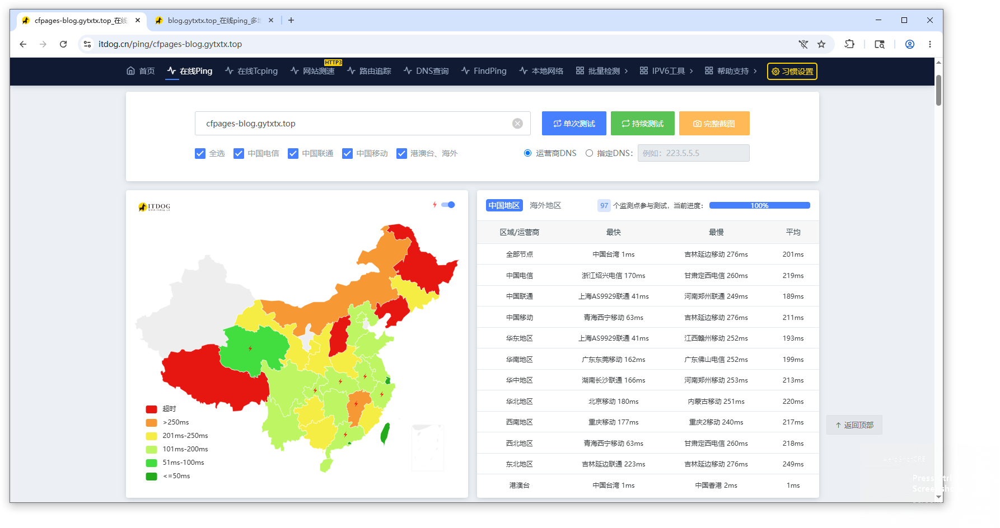
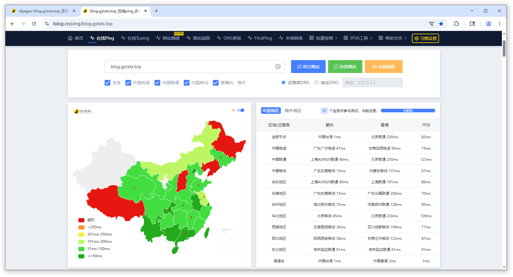

---
date:
  created: 2026-05-22

# draft: true

readtime: 6

authors:
  - gytxtx

categories:
  - 日常

slug: Monthly-Summary

comments: true
---

# 停更的这几个月，我在做什么

各位好久不见。

已经有好几个月没更新博客了。期间其实有好几次想写点什么，但总感觉不知道该从哪里开始。

这篇文章就当作一次近况总结吧，和大家聊聊这段时间我折腾过的一些事情。

<!-- more -->

写得比较仓促，如有表述错误，还请多多包涵。

---

关键词：**办卡后续**、**搭建网盘**、**网站性能优化**、**软件开发**

## 办卡后续

上文参见 [琐事记 #3：训练日常、烫伤、长春一日游](https://blog.gytxtx.top/blog/2025/12/28/Weekly-Diary_3/) 这篇文章。

放假后的 2026 年 1 月 22 日，我带着身份证、户口簿和出生证明，又去了一趟长春领取之前预约的银行卡。

办理过程倒是比我想象中顺利不少。工作人员带我到柜员机前填写了一些资料，因为手机号实名是我母亲的，还额外登记了手机号注册人的身份信息。

之后，她从卡库里取出了我预约的那张卡。整个过程大概用了二十分钟。

---

## 搭建网盘

我最近喜欢玩的游戏 Enter The Nyangeon 发布了新版本，但作者提供的下载方式只有 QQ 群和百度网盘。

问题在于，这两个平台都需要登录账号、绑定手机号，很多时候还得安装客户端才能正常下载。

对于手机不在身边、或者人在学校机房的用户（比如我）来说，这种体验实在算不上友好。

于是我就在想：

> 既然现有下载方式不好用，那我能不能自己搭建一个下载站？

说干就干。我最开始部署的是 Cloudreve，并直接使用服务器硬盘存储文件。

但实际用下来之后，我很快就发现了问题：

服务器的上行带宽有限，一旦同时下载的人多起来，速度就会明显下降；而我手里的 VPS 硬盘也只有 30 GB 左右，根本放不了太多东西。

后来有朋友给我提了个建议：

> “为什么不用对象存储？”

我之前其实听说过对象存储，但一直没真正研究过。于是我去查了一下，发现它确实很适合我这种场景：

* 不需要自己维护大容量磁盘
* 可以按需扩展
* 文件下载不占用服务器带宽
* 成本也相对比较低

最后，我选择了 Cloudflare R2。

我比较看重的一点是：R2 没有出口流量费用（Egress Fee）。

目前我的 bucket 是 private 类型，每次下载都会由 OpenList 动态生成带签名的临时链接，再由用户直接从 R2 下载。

这样既不用公开 bucket，也能减少服务器本身的带宽压力。

另外，R2 的免费额度（A、B 类操作）对我目前这种个人项目来说也完全够用。

---

## 网站性能优化

本站之前托管在 Cloudflare Pages，并开启了 Cloudflare CDN。

但国内访问体验一直不算理想，尤其是 TTFB 偏高，某些地区甚至能到 1000ms 以上。

对于博客这种多页面网站来说，这种延迟其实挺影响阅读体验的。

后来我尝试了 Cloudflare IP 优选方案，通过将域名解析到延迟更低的 Cloudflare 节点，最终明显改善了国内访问速度。

我参考了下面这篇文章的方法进行优选：

[试试 Cloudflare IP 优选！让 Cloudflare 在国内再也不是减速器！](https://2x.nz/posts/cf-fastip/)

以下是优化前后的测速结果对比：

虽然 ITDOG 最近部分检测节点因为攻击问题不可用，但整体趋势还是能明显看出优化效果。

优化之后，国内大部分地区的平均延迟和首包时间都改善了不少，访问体验也比之前舒服很多。

---

## 软件开发

大概是 2025 年冬季，我买了一块使用嘉佰达 BMS 方案的锂电池组。

但配套的官方 App 用起来实在让我难受：

* 动不动就弹登录
* UI 和功能层级一团乱
* 某些功能甚至还要联网
* 电池参数编辑也被限制

最让我受不了的一点是：

我明明只是想打开 App 看一眼剩余电量，却还要先登录账号。

其实我很早之前就有自己开发替代 App 的想法。

但以前的我完全不会 Java，更别提 Android 开发了，因此这个想法一直停留在“想想而已”的阶段。

而现在，有了 AI 开发工具之后，情况开始不一样了。

我先反编译了原厂 APK，分析通信逻辑，然后让 Codex 帮我生成一个最小可运行原型（MVP）。

第一次在设备上真正跑起来的时候，我整个人都激动坏了。

之后，我继续让 Codex 协助完善功能、优化 UI 和交互体验。

到现在，这个 App 对我来说已经完全够用了。

它只需要蓝牙权限即可工作；在旧版本 Android 上，可能还需要定位权限。

目前项目已经在 GitHub 开源，欢迎各位提出建议或 Pull Request：

<https://github.com/gytxtx/OpenJBD>

---

## 结尾

这几个月大概就是这样。

虽然折腾了不少东西，也踩了不少坑，但至少现在，我终于能逐渐把一些“不好用”的东西替换成自己真正想要的样子了。

或许这也是折腾技术最有意思的一点吧。
